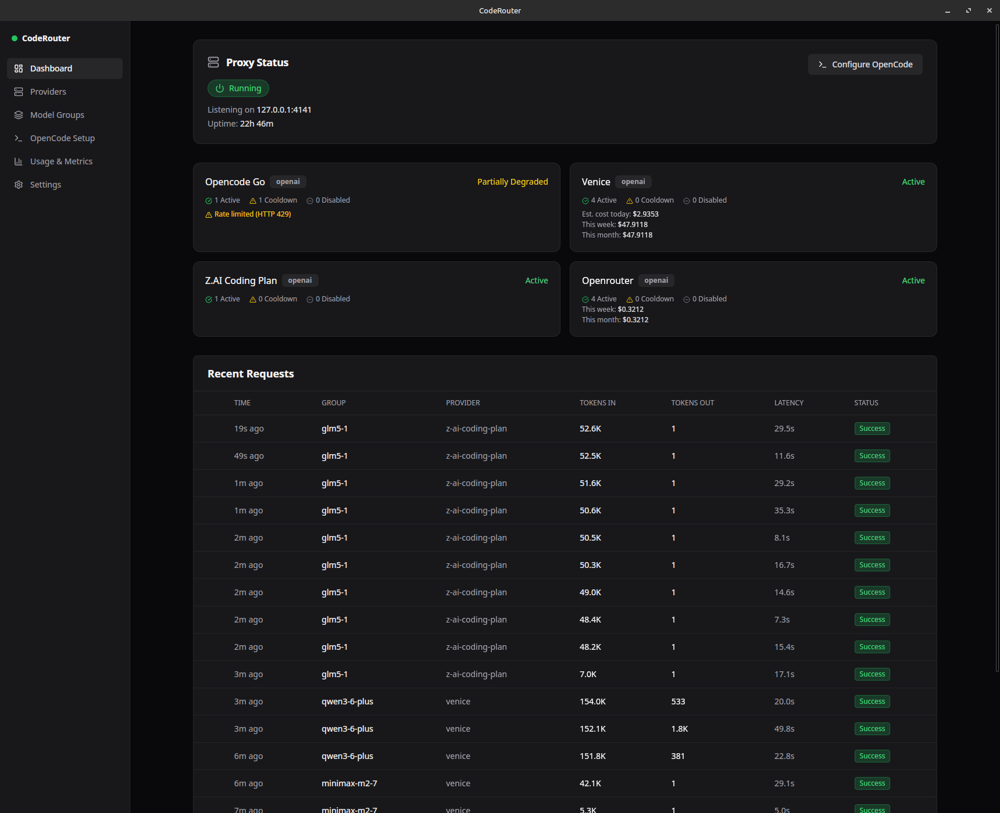

# CodeRouter

[](https://github.com/CWinthorpe/codeRouter/actions/workflows/release.yml)

A desktop application that acts as a local OpenAI-compatible proxy router. Sits between AI coding tools (like [OpenCode](https://opencode.ai)) and multiple upstream LLM providers, providing intelligent failover, cost management, model grouping, and seamless OpenCode configuration integration.

Built with **Tauri 2.x** (Rust sidecar + React/TypeScript frontend). Distributed as **AppImage** (Linux), **DMG** (macOS), and **EXE installer** (Windows).

## Screenshots

### Dashboard



## Why CodeRouter?

If you use multiple LLM providers or multiple accounts with the same provider, CodeRouter lets you:

- **Pool them together** behind a single local endpoint — your AI tools only need to know about one URL
- **Set up automatic failover** — when one provider hits a rate limit or goes down, requests seamlessly fall over to the next provider in line
- **Track costs and usage** — see exactly what each provider is costing you, with charts, daily quotas, and exportable reports
- **Auto-configure OpenCode** — one-click setup to route OpenCode agents through CodeRouter with per-agent model mapping

## Features

### Provider Management
- **Multi-Provider Aggregation** — Add unlimited OpenAI-compatible and Anthropic-compatible providers behind a single local endpoint (`localhost:4141`)
- **Model Discovery** — Automatically fetch available models and metadata (context windows, pricing) from provider APIs
- **Per-Model Overrides** — Manually correct context sizes, pricing, or model names when provider APIs return incomplete data
- **Secure Credential Storage** — API keys stored in the Linux Secret Service (libsecret), never in config files

### Model Groups & Failover
- **Priority-Based Routing** — Group multiple provider+model pairs under a single virtual model name with configurable priority ordering
- **Automatic Failover** — Transparent failover on HTTP 429 rate limits, daily quota exhaustion, consecutive errors, or latency timeouts — all configurable per group
- **Smart Recovery** — Exponential backoff with probe-based re-enable for rate-limited providers; quota-aware scheduling for daily resets
- **Cooldown Tracking** — See exactly why each provider entry is in cooldown with human-readable reasons

### Usage Tracking & Metrics
- **SQLite-Backed Metrics** — Per-provider costs, token usage, latency percentiles, and request logs
- **Live Dashboard** — Real-time token throughput, provider health cards, and recent request feed
- **Historical Charts** — Cost and token usage by provider, request volume by group, with date range filtering
- **CSV Export** — Download your usage data for analysis

### OpenCode Integration
- **One-Click Setup** — Auto-configure OpenCode to use CodeRouter as a provider
- **Agent Mapping** — Assign different model groups to OpenCode agents (build, plan, general, explore)
- **Custom Agents & Subagents** — Create specialized agents from templates or scratch, saved as markdown files in OpenCode's native format. Includes AI-powered prompt enhancement, permission management, and model group assignment
- **Surgical JSON Patching** — Only updates the relevant sections of OpenCode config, preserving all other settings

### Desktop Experience
- **System Tray** — Green/red status indicator, quick start/stop proxy, hide-to-tray on window close
- **Dark Theme UI** — Built with shadcn/ui + Tailwind CSS
- **AppImage Distribution** — Self-contained Linux binary, no installation required

## Tech Stack

| Layer | Technology |
|---|---|
| Desktop shell | Tauri 2.x (AppImage target) |
| Proxy service | Rust (Axum HTTP server, Tauri sidecar) |
| Frontend UI | React 18 + TypeScript + Vite |
| UI components | shadcn/ui + Tailwind CSS |
| Config storage | JSON files (`~/.config/coderouter/`) |
| Credential storage | Linux Secret Service via `libsecret` |
| Metrics DB | SQLite (`rusqlite`, bundled) |

## System Requirements

- Linux (tested on Linux) — other desktop distros should work
- GTK3, WebKit2GTK (standard on most desktop distros)
- `libayatana-appindicator3-1` (system tray support)

## Quick Start

### Download the Latest Release

Grab the latest AppImage from [Releases](https://github.com/CWinthorpe/codeRouter/releases):

```bash
chmod +x CodeRouter_0.1.21_amd64.AppImage
./CodeRouter_0.1.21_amd64.AppImage
```

On first launch, CodeRouter creates `~/.config/coderouter/` and `~/.local/share/coderouter/`.

### Running from Source

```bash
# Install system dependencies (Debian/Ubuntu)
sudo apt-get install -y libgtk-3-dev libwebkit2gtk-4.1-dev libayatana-appindicator3-dev

# Clone and build
git clone https://github.com/CWinthorpe/codeRouter.git
cd codeRouter
npm install

# Development mode
make dev

# Production build (AppImage)
make build
```

The AppImage will be produced at `target/release/bundle/appimage/CodeRouter_0.1.21_amd64.AppImage`.

## Proxy API

The sidecar exposes a standard OpenAI-compatible REST API on `http://localhost:4141`:

| Endpoint | Method | Description |
|---|---|---|
| `/v1/models` | GET | List all enabled model groups |
| `/v1/chat/completions` | POST | Chat completion (streaming + non-streaming) |
| `/v1/completions` | POST | Legacy completions |
| `/health` | GET | Proxy status and uptime |

No authentication required — the proxy handles upstream auth internally.

### Example Usage

```bash
# Check health
curl http://localhost:4141/health

# List available model groups
curl http://localhost:4141/v1/models

# Chat completion (non-streaming)
curl http://localhost:4141/v1/chat/completions \
  -H "Content-Type: application/json" \
  -d '{"model": "glm-5-router", "messages": [{"role": "user", "content": "Hello"}]}'

# Chat completion (streaming)
curl http://localhost:4141/v1/chat/completions \
  -H "Content-Type: application/json" \
  -d '{"model": "glm-5-router", "messages": [{"role": "user", "content": "Hello"}], "stream": true}'
```

### Using with OpenCode

Add CodeRouter as a provider in your OpenCode config:

```json
{
  "provider": {
    "coderouter": {
      "npm": "@ai-sdk/openai-compatible",
      "name": "CodeRouter",
      "options": {
        "baseURL": "http://localhost:4141/v1",
        "apiKey": "coderouter"
      }
    }
  }
}
```

Or use the OpenCode Setup tab in the CodeRouter UI for automatic configuration with agent mapping.

## Configuration

Config files live at `~/.config/coderouter/`:

```
~/.config/coderouter/
  config.json          # App settings (port, host, refresh interval, log verbosity)
  providers.json       # Upstream provider configs
  groups.json          # Model group definitions
  opencode.json        # Cached OpenCode integration settings

~/.local/share/coderouter/
  metrics.db           # SQLite usage/metrics database
  proxy.log            # Sidecar log file
```

API keys are stored in the Linux Secret Service (libsecret), never in config files.

## TUI (Terminal Interface)

CodeRouter includes a terminal UI for managing providers, groups, usage, and settings from the command line. Built with [Ratatui](https://ratatui.rs/).

### Building the TUI

```bash
# Build TUI binary only
make tui

# Or via build.sh
./build.sh --tui-only

# Build both GUI (AppImage) and TUI
./build.sh --tui
```

### Running the TUI

```bash
# Dev mode (with debug output)
make tui-dev

# Or run the release binary directly
./target/release/coderouter-tui
```

### ARM64 Cross-Compilation

```bash
# Install the target
rustup target add aarch64-unknown-linux-gnu

# Build for ARM64
make tui-arm64

# Note: When libsecret is unavailable on ARM64, file-based credential fallback is used.
```

### TUI Key Bindings

| Key | Action |
|---|---|
| `1`-`6` | Switch tab |
| `Tab` / `S-Tab` | Next / previous tab |
| `?` | Show help overlay |
| `q` | Quit |
| `j`/`k` or `↑`/`↓` | Navigate / scroll |

Page-specific keys are shown in the help overlay (press `?`).

## Release Pipeline

Pushing a version tag triggers the [GitHub Actions release workflow](https://github.com/CWinthorpe/codeRouter/actions/workflows/release.yml) which builds all platforms in parallel:

```bash
# Bump version in src-tauri/tauri.conf.json, then:
git tag v0.1.23
git push origin v0.1.23
```

For local Linux builds you can still use:

```bash
make release        # full pipeline: build + publish (Linux only)
./build.sh --release   # build all Linux artifacts into dist/
```

### Artifacts

| Artifact | Platform | Description |
|---|---|---|
| `CodeRouter_<VER>_amd64.AppImage` + `.sig` | Linux x86_64 | GUI desktop app (signed) |
| `coderouter-tui-<VER>-linux-x86_64.tar.gz` | Linux x86_64 | TUI + proxy |
| `coderouter-tui-<VER>-linux-aarch64.tar.gz` | Linux ARM64 | TUI + proxy |
| `CodeRouter_<VER>_x64.dmg` | macOS Intel | GUI desktop app |
| `coderouter-tui-<VER>-macos-x86_64.tar.gz` | macOS Intel | TUI + proxy |
| `CodeRouter_<VER>_aarch64.dmg` | macOS Apple Silicon | GUI desktop app |
| `coderouter-tui-<VER>-macos-aarch64.tar.gz` | macOS Apple Silicon | TUI + proxy |
| `CodeRouter_<VER>_x64-setup.exe` | Windows x86_64 | GUI installer |
| `coderouter-tui-<VER>-windows-x86_64.zip` | Windows x86_64 | TUI + proxy |
| `latest.json` | All | Tauri updater manifest |

### Installing the TUI tarball

**Linux / macOS:**
```bash
tar xzf coderouter-tui-<VERSION>-<platform>.tar.gz
cd coderouter-tui-<VERSION>-<platform>
chmod +x coderouter-tui coderouter-proxy
./coderouter-tui
```

**Windows:**
```powershell
Expand-Archive coderouter-tui-<VERSION>-windows-x86_64.zip
cd coderouter-tui-<VERSION>-windows-x86_64
.\coderouter-tui.exe
```

### Versioning

Version is read from `src-tauri/tauri.conf.json` (`"version"` field). Bump it there, then push a `v*` tag to trigger the release workflow.

### Previewing release notes

```bash
make release-notes
```

## Development

```bash
# Run all tests
make test          # cargo test --workspace

# TypeScript check
npx tsc --noEmit

# Build AppImage
make build         # runs ./build.sh

# Build TUI only
make tui           # cargo build --release -p coderouter-tui

# Run TUI in dev mode
make tui-dev       # cargo run -p coderouter-tui

# Dev mode with hot reload
make dev           # npm run tauri dev
```

### Project Structure

```
codeRouter/
├── sidecar/              # Rust proxy binary
│   └── src/
│       ├── config/       # JSON config store + serde models
│       ├── credentials/  # libsecret keychain wrapper
│       ├── metrics/      # SQLite recorder, queries, scheduler
│       ├── models/       # Upstream model discovery
│       ├── opencode/     # OpenCode config writer + custom agents
│       └── proxy/        # Axum server, router, protocol translator
├── src-tauri/            # Tauri desktop shell
│   └── src/
│       ├── commands.rs   # All Tauri IPC commands
│       └── main.rs       # Entry point, sidecar lifecycle, tray
├── src/                  # React frontend
│   ├── components/       # AppShell, CustomAgentsManager, shared UI
│   ├── pages/            # Dashboard, Providers, Groups, etc.
│   ├── store/            # Zustand global state
│   ├── lib/ipc.ts        # Typed IPC wrapper
│   └── types/index.ts    # Shared TypeScript types
├── build.sh              # AppImage build script
├── Makefile              # build / dev / test / tui targets
└── tui/                  # Terminal UI (Ratatui)
    └── src/
        ├── main.rs       # Entry point, panic hook, sidecar lifecycle
        ├── app.rs        # App state, key routing, tab management
        ├── pages/        # Dashboard, Providers, Groups, OpenCode, Usage, Settings
        ├── widgets/      # Tab bar, status bar, help overlay, toast
        └── presets.rs    # Provider preset definitions
```

## License

MIT
